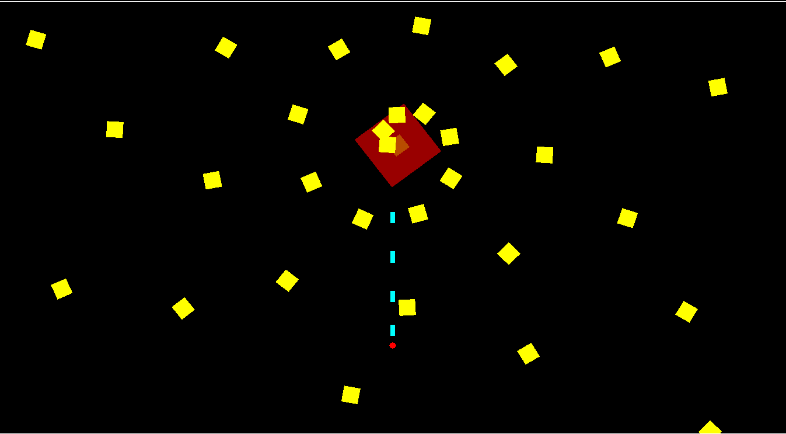
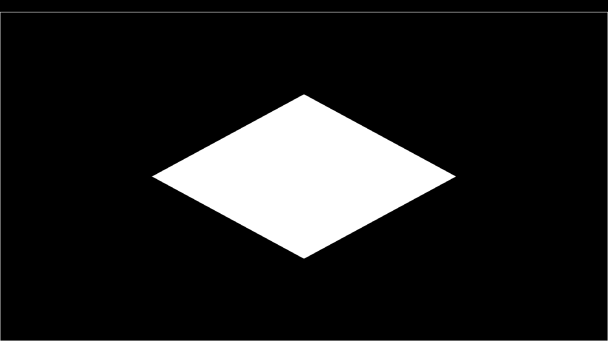
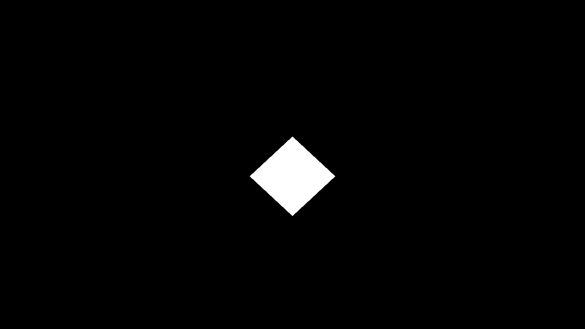
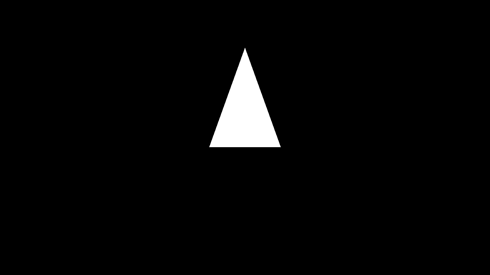
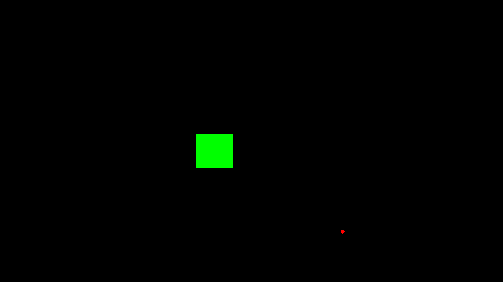
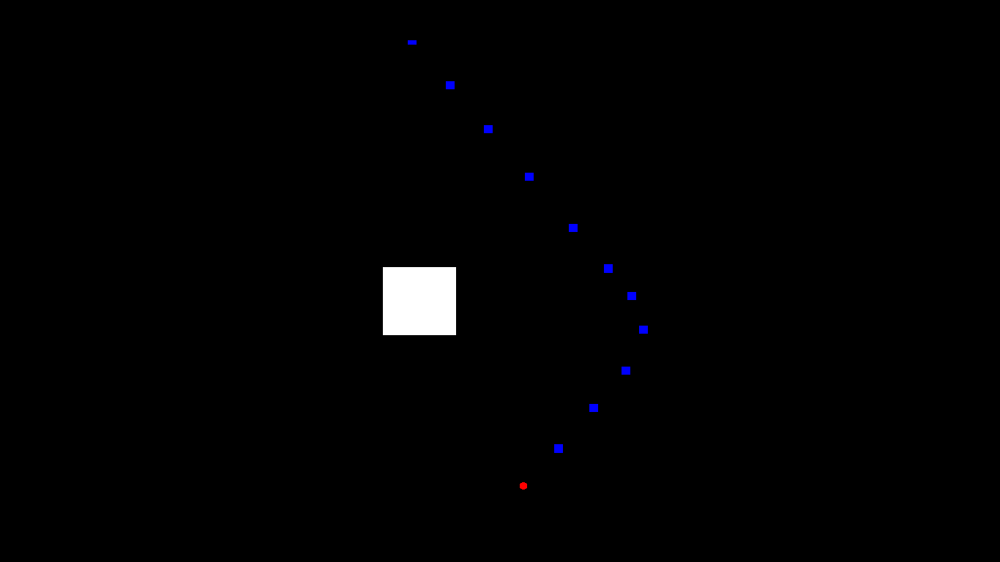

<h1 id="using-glfw-and-simple-opengl-to-create-a-simple-shoot-'em-up-game">Using GLFW (and simple OpenGL) to create a simple shoot 'em up game.</h1>

OpenGL is the first programming utility that I use during my days of programming and doing tasks. At first it is confusing in many ways (because I am a confused person). It works with C and most of C's friends, one of them that I like to use is C++.

Just a heads up, this is usually just for testing or for fun. If you want to make a serious or complete game, I suggest searching for guides deeper in <a href="https://github.com/search">Github</a> or other websites for more advanced tutorials.

First things first, I will explain on how some things work in C++. If you don't have it, I suggest downloading it by using <a href="http://www.mingw.org/wiki/Getting_Started">MinGW</a> for Windows. On Linux, use the usual

<blockquote>
sudo apt-get install g++
</blockquote>

You will also need <a href="http://www.glfw.org/download.html">GLFW</a>, although you're free to use other OpenGL utilities as well.

Once they have been downloaded, you will needa basic concept of object-oriented programming (or just explore C++ for yourself). There are many ways to represent a shoot 'em up (or shmup) game, so it is encouraged for you to find your own style afterwards.

First of all, get started with GLFW <a href="http://www.glfw.org/docs/latest/quick.html">here</a>. Put those codes in the main program int main(). You will need at least these codes in the body:

<ul style="list-style-type: square;">
 <li>the glfwInit</li>
 <li>a glfwWindow (using glfwCreateWindow)</li>
 <li>select the window with glfwMakeContextCurrent</li>
 <li>a way of input, either with <a href="http://www.glfw.org/docs/latest/input_guide.html#input_keyboard">Keyboard</a> or <a href="http://www.glfw.org/docs/latest/input_guide.html#input_mouse">Mouse</a></li>
 <li>set a swap buffer of 1 with glfwSwapInterval(1);</li>
 <li>the main drawing code: while (!glfwWindowShouldClose(yourWindowName)) { } </li>
 <li>before the end braces of the above code, add glfwSwapBuffers(window); and glfwPollEvents();</li>
 <li>glfwDestroyWindow() and glfwTerminate() at the end</li>
 <li>(optional) a way to use time (glfwGetTime() usage)</li>
</ul>

For basics: the initialisation codes will go before the while (!glfwWindowShouldClose()) main loop, the drawing and animation goes inside the main loop.

<h2>Drawing shapes in OpenGL</h2>

If you're fond of more advances features (which will probably be more useful than this), I highly suggest reading the well-documented <a href="http://www.opengl-tutorial.org/beginners-tutorials/tutorial-2-the-first-triangle/">OpenGL Tutorial</a> here.

Drawing in OpenGL in its simplest way uses glBegin(shape_type), glVertex2f(pointx, pointy), glEnd(). For the shape_type, use GL_TRIANGLES for triangles, GL_QUADS for rectangles, GL_POLYGON for a convex shape, GL_LINE_LOOP to make the shape outline only. For squres and triangles, make sure to have 3 and 4 points or glVertex2f codes respectively. The window acts like a Cartesian grid, with point (0,0) being at the center, positive x-axis to the right and positive y-axis upwards.

For example: in the main loop, enter these codes:

<pre class="highlight"><code>glBegin(GL_QUADS);
 glVertex2f(0.5, 0.0);
 glVertex2f(0.0, 0.5);
 glVertex2f(-0.5, 0.0);
 glVertex2f(0.0, -0.5);
glEnd();
</code></pre>

And it will produce the following output: 

The pointx and pointy values represent the position relative to the center. For example, glVertex2f(1.0, 0.0) means that the point will be at the top and center of the screen. It is possible to draw points beyond the screen (try changing one of the vertexes to glVertext2f(2.0, 0.0)). If you want to get pixel values, get and store the window's width and length as you use glfwCreateWindow(). Alternatively, if you plan on going full screen, get window width and height from the primary monitor like this:

<pre class="highlight"><code>const GLFWvidmode* mode = glfwGetVideoMode(glfwGetPrimaryMonitor());

HEIGHT = mode->height;
WIDTH = mode->width;

GLFWwindow *window = glfwCreateWindow(WIDTH, HEIGHT, "Title", glfwGetPrimaryMonitor(), NULL);
</code></pre>

Note: Don't forget to declare HEIGHT and WIDTH as global variables (variables outside the main program).

If you plan on using windowed full screen, change the fourth parameter in glfwCreateWindow() to NULL. For more details on modifying windows, check the <a href="http://www.glfw.org/docs/latest/window_guide.html">GLFW Documentation</a>. Afterwards, make a function to change values from negative half of window height to half of window height, into a number between -1.0 and 1.0, the same goes for window width. You can do that with these functions:

<pre class="highlight"><code>float newWidth(float oldWidth) {
 return 2 * oldWidth / WIDTH;
}

float newHeight(float oldHeight) {
 return 2 * oldHeight / HEIGHT;
}
</code></pre>

And now, you can modify the above code to have pixel lengths. The following code will result this image:

<pre class="highlight"><code>glBegin(GL_QUADS);
 glVertex2f(newWidth(100), newHeight(0.0));
 glVertex2f(newWidth(0.0), newHeight(100));
 glVertex2f(newWidth(-100), newHeight(0.0));
 glVertex2f(newWidth(0.0), newHeight(-100));
glEnd();
</code></pre>

This method, although straightforward, is somewhat tedious as we have to insert the function everytime we need to draw a point. Another method, which is a bit easier to use, is the glDrawArrays() method. First, enter glEnableClientState (GL_VERTEX_ARRAY); before the main loop to use arrays. Then, define the array of points that you will draw, either as a global variable or somewhere else as long as it's accessible in the main loop. Next, enter glVertexPointer() to use your array. Last, simply call glDrawArrays(). The following code will illustrate the example of drawing a triangle in the main loop:

<pre class="highlight"><code>GLfloat myTriangle[3*2];
myTriangle[0] = newWidth(100); myTriangle[1] = newHeight(0);
myTriangle[2] = newWidth(-100); myTriangle[3] = newHeight(0);
myTriangle[4] = newWidth(0); myTriangle[5] = newHeight(400);

glVertexPointer (2, GL_FLOAT, 0, myTriangle);
glDrawArrays(GL_TRIANGLES, 0, 3);
</code></pre>

Note: Don't forget to use glEnableClientState (GL_VERTEX_ARRAY);

For a more complete information on these techniques, take a look at <a href="http://www.glprogramming.com/red/chapter02.html">this</a> documentation.

The above code is an example but hopefully it will give you an idea on how to use it, and perhaps optimize your code with loops and functions. in glVertexPointer(), the last parameter is to be changed if you want to use another array. In glDrawArrays(), first parameter is the shape type, third parameter is the number of points you will draw, its value should be half the array size.

If you want to add color, use glColor3f(r, g, b), where r, g, b stands for red, green, and blue values respectively, with colors ranging from 0.0 to 1.0. Values below 0 will be treated as 0, values above 1 will be treated as 1. If you want transparency and blending, use glColor4f(r, g, b, a) where the a determines opaqueness level (0 is invisible and 1 is opaque), and add these 2 lines of code before the main loop for transparency to work:

<pre class="highlight"><code>glEnable(GL_BLEND);
glBlendFunc(GL_SRC_ALPHA, GL_ONE_MINUS_SRC_ALPHA);
</code></pre>

<h2>Shmup Game Basics</h2>

Shoot 'em up games usually involve an avatar, trying to shoot through enemies while trying to stay alive at the same time. The game itself has varied from classic shmup games with one shooting style, to an upgradable weapon system, to reflex-challenging stages, and so on. The variety is huge, but they usually have a common theme.

<h3>Your Avatar</h3>

Also known as your ship, your character, anything that is under your control and is in the gameplay. Usually, your avatar has the ability to shoot (hence, being a sub-genre of the shooter genre), although there are other games where you can't directly shoot. The avatar is also the one you want to control out of the way of incoming obstacles, such as bullets, walls, or even the enemies themselves. From there, people are free to add their own special abilities to the avatar (or different abilities for different available avatars), such as sub-weapons, bombs (screen clearing), shield, and so on.

<button type="button" onclick="if (document.getElementById('message1').style.display=='none'){ document.getElementById('message1').style.display='' } else { document.getElementById('message1').style.display='none' }">Show / Hide</button>
<h3>The Enemies</h3>

As mentioned earlier, there are obstacles to dodge. These can be divided into two main categories: shootable obstacles and non-shootable obstacles. From there, you are free to control the strength of your shots, the enemies' health, the enemies' moving pattern and attack pattern, as well as other obstacles' characteristics. The possibilites are huge, this article will not be able to cover all of them. It's best that you explore each of them by yourself.

<button type="button" onclick="if (document.getElementById('message2').style.display=='none'){ document.getElementById('message2').style.display='' } else { document.getElementById('message2').style.display='none' }">Show / Hide</button>
<h3>Game Features</h3>

The classic way of adding a feature into the game is to add a high score, which can be determined by a number of factors, such as number of enemies destroyed, what kinds of enemies are destroyed, accuracy, etc. You can also add lives to the game so that your avatar has a second chance to fight. You can also add a timer in the gameplay, it's tricky since you have to draw your own numbers on the screen, but it is possible. You can also decorate the game with a main menu, a help menu, and even settings. If you're ambitious, you can also add your soundtrack in the game. Do explore what can be done.

<button type="button" onclick="if (document.getElementById('message3').style.display=='none'){ document.getElementById('message3').style.display='' } else { document.getElementById('message3').style.display='none' }">Show / Hide</button>
<h2>Making The Mechanics: Stage One</h2>

If you have a bit of object-oriented programming knowledge, this might seem a bit easier to you. Let's get through this step-by-step.

<h3>The Shapes</h3>

We need to define the characteristics of each obstacle. This is where object-oriented programming comes in. For now, let's say that every enemy has points to draw, health, speed and direction of movement. We will define this in a class called Enemy. (To make it better, make the class inherit a Point class)

<pre class="highlight"><code>class Enemy {
 protected:
  GLfloat *points;
  int n; //number of Points
  
  float speed;
  float direction;
  float health;
 public:
  Enemy(int n);
  Enemy(int n, int health);
  virtual ~Enemy();
  
  float getSpeed() const;
  float getDirection() const;
  void setSpeed(float newSpeed);
  void setDirection(float newDirection);
  void damage(int dmg);
  virtual void move();
  bool isDead() const;
  
  GLfloat* getPoints();
  int getN() const;
};
</code></pre>

<button type="button" onclick="if (document.getElementById('message4').style.display=='none'){ document.getElementById('message4').style.display='' } else { document.getElementById('message4').style.display='none' }">View Sample Code</button>  

<pre class="highlight"><code>Enemy::Enemy(int n, int health) {
 speed = 0;
 direction = 0;
 this->n = n;
 points = new GLfloat[n*2];
 this->health = health;
}
bool Enemy::isDead() const {
 return (health <= 0);
}
float toRadian(float degrees) { //Helper function
 return degrees*M_PI/180;
}
void Enemy::move() {
 for (int i = 0; i < n*2; i+=2) {
  points[i] = points[i] + newWidth(speed*cos(toRadian(direction)));
  points[i+1] = points[i+1] + newHeight(speed*sin(toRadian(direction)));
 }
}
</code></pre>

We need a way to use the height and width in most files, other than the main program. For that, make a helper class, let's call it the Dimensions class, and move the newWidth and newHeight functions there.

<pre class="highlight"><code>class Dimensions {
 private:
  static double width, height;
 public:
  Dimensions(); //ctor (unused)
  Dimensions(double w, double h);
  virtual ~Dimensions();
  double getWidth() const;
  double getHeight() const;
};

float newWidth(float oldWidth);
float newHeight(float oldHeight);

//Cpp code
double Dimensions::width;
double Dimensions::height;

Dimensions::Dimensions() {
}
Dimensions::Dimensions(double w, double h) {
 width = w;
 height = h;
}
Dimensions::~Dimensions() {
}
double Dimensions::getWidth() const {
 return width;
}
double Dimensions::getHeight() const {
 return height;
}

float newWidth(float oldWidth) {
 return 2*oldWidth / Dimensions().getWidth();
}
float newHeight(float oldHeight) {
 return 2*oldHeight / Dimensions().getHeight();
}
</code></pre>

<button type="button" onclick="if (document.getElementById('message6').style.display=='none'){ document.getElementById('message6').style.display='' } else { document.getElementById('message6').style.display='none' }">Dimensions Code</button>

<button type="button" onclick="if (document.getElementById('message5').style.display=='none'){ document.getElementById('message5').style.display='' } else { document.getElementById('message5').style.display='none' }">Click Here For Partial cpp Code</button>

Now, let's test the features. Let's make a triangle enemy that goes to the bottom of the screen and close the window if it touches the bottom of the screen. We can do it like this:

<pre class="highlight"><code>//Outside main loop
//Use the Dimensions class like this:
double HEIGHT;
double WIDTH;
const GLFWvidmode* mode = glfwGetVideoMode(glfwGetPrimaryMonitor());
HEIGHT = mode->height;
WIDTH = mode->width;
Dimensions(WIDTH, HEIGHT);
GLFWwindow *window = glfwCreateWindow(WIDTH, HEIGHT, "TestDriver", glfwGetPrimaryMonitor(), NULL);
 
Enemy firstEnemy(3);
 firstEnemy.getPoints()[0] = newWidth(100); firstEnemy.getPoints()[1] = newHeight(HEIGHT);
 firstEnemy.getPoints()[2] = newWidth(-100); firstEnemy.getPoints()[3] = newHeight(HEIGHT);
 firstEnemy.getPoints()[4] = newWidth(0); firstEnemy.getPoints()[5] = newHeight(HEIGHT-150);
 
 firstEnemy.setSpeed(6);
 firstEnemy.setDirection(270);

//Inside main loop
if (firstEnemy.getPoints()[5] < -1.0)
 glfwSetWindowShouldClose(window, GLFW_TRUE);
else {
 firstEnemy.move();
 glColor3f(1.0,1.0,0.0);
 glVertexPointer (2, GL_FLOAT, 0, firstEnemy.getPoints());
 glDrawArrays(GL_TRIANGLES, 0, 3);
}
</code></pre>

It's not convenient if we want to make a lot of obstacles and we need to define every point. One of the ways to solve this is to make a class that automatically creates the shape that you need. For now, let's make a Square class. In this way, we can also define features that cannot be previously implemented in Enemy class, one of them is collision checking.

<pre class="highlight"><code>class Square : public Enemy {
 protected:
  float side;
  float x, y;
 public:
  Square(float x, float y, float side);
  Square(float x, float y, float side, int health);
  virtual ~Square();

  float getSide() const;
  float getX() const;
  float getY() const;
  void setSide(float newSide);
  bool collideWith(float x, float y);
  void move();
};
//Partial cpp code
Square::Square(float x, float y, float side, int health) : Enemy(4, health) {
 this->side = side;
 points[0] = newWidth(x - side/2);
 points[1] = newHeight(y - side/2);
  
 points[2] = newWidth(x - side/2);
 points[3] = newHeight(y + side/2);
  
 points[4] = newWidth(x + side/2);
 points[5] = newHeight(y + side/2);
  
 points[6] = newWidth(x + side/2);
 points[7] = newHeight(y - side/2);
 this->x = x;
 this->y = y;
}
Square::Square(float x, float y, float side) : Square(x, y, side, 1) {
}
Square::~Square() {
}
void Square::move() {
 Enemy::move();
 x = x + speed*cos(toRadian(direction));
 y = y + speed*sin(toRadian(direction));
}
bool Square::collideWith(float x, float y) {
 return (x > this->x - side/2 && x < this->x + side/2) && (y > this->y - side/2 && y < this->y + side/2);
}
</code></pre>

<button type="button" onclick="if (document.getElementById('message7').style.display=='none'){ document.getElementById('message7').style.display='' } else { document.getElementById('message7').style.display='none' }">View Sample Code</button>

Here is an example code of a square alternatingly going left and right:

<pre class="highlight"><code>//Outside main loop
Square secondEnemy(0, 0, 100);
 secondEnemy.setSpeed(5);
 secondEnemy.setDirection(180);

//Inside main loop
secondEnemy.move();
if (secondEnemy.collideWith(-WIDTH/2, 0))
 secondEnemy.setDirection(0);
else if (secondEnemy.collideWith(WIDTH/2, 0))
 secondEnemy.setDirection(180);
glColor3f(0.0,1.0,0.0);
glVertexPointer (2, GL_FLOAT, 0, secondEnemy.getPoints());
glDrawArrays(GL_QUADS, 0, 4);
</code></pre>

For now, let's use the Square class to make the gameplay, which consists of a shooter, an enemy, the shots by your avatar and the shots by enemies. If you're going to use a lot of functions that manipulate the Squares and other objects, make the objects as global variables.

Let's focus on making an avatar. For now, let's make it as a small octagon. Make this as a function, and then put the function in the main loop.

<pre class="highlight"><code>GLfloat avatarPoints[16];
double xpos, ypos;
bool goingUp = false,
 goingDown = false,
 goingLeft = false,
 goingRight = false;
float sqrtTwo = sqrt(2);
void drawAvatar() {
 if (goingUp && ypos < HEIGHT/2)
  ypos += 4;
 else if (goingDown && ypos > -HEIGHT/2)
  ypos -= 4;
 if (goingRight && xpos < WIDTH/2)
  xpos += 4;
 else if (goingLeft && xpos > -WIDTH/2)
  xpos -= 4;
 glColor3f(1.0,0.0,0.0);
 avatarPoints[0] = newWidth(xpos-4);
 avatarPoints[1] = newHeight(ypos-4);
 avatarPoints[2] = newWidth(xpos);
 avatarPoints[3] = newHeight(ypos-4*sqrtTwo);
 avatarPoints[4] = newWidth(xpos+4);
 avatarPoints[5] = newHeight(ypos-4);
 avatarPoints[6] = newWidth(xpos+4*sqrtTwo);
 avatarPoints[7] = newHeight(ypos);
 avatarPoints[8] = newWidth(xpos+4);
 avatarPoints[9] = newHeight(ypos+4);
 avatarPoints[10] = newWidth(xpos);
 avatarPoints[11] = newHeight(ypos+4*sqrtTwo);
 avatarPoints[12] = newWidth(xpos-4);
 avatarPoints[13] = newHeight(ypos+4);
 avatarPoints[14] = newWidth(xpos-4*sqrtTwo);
 avatarPoints[15] = newHeight(ypos);
 
 glVertexPointer (2, GL_FLOAT, 0, avatarPoints);
 glDrawArrays(GL_POLYGON, 0, 8);
}
</code></pre>

Note the if-else conditions. This is done so that the avatar does not go off screen. To control the avatar, make use of the key or mouse callback functions. Let's control the avatar with the keyboard.

<pre class="highlight"><code>void keyCallback(GLFWwindow* window, int key, int scanc, int act, int mods) {
 if (act == GLFW_PRESS) {
  switch (key) {
   case GLFW_KEY_UP: goingUp = true;
   break;
   case GLFW_KEY_DOWN: goingDown = true;
   break;
   case GLFW_KEY_RIGHT: goingRight = true;
   break;
   case GLFW_KEY_LEFT: goingLeft = true;
   break;
   case GLFW_KEY_ESCAPE: glfwSetWindowShouldClose(window, GLFW_TRUE);
   break;
  }
 } else if (act == GLFW_RELEASE) {
  switch (key) {
   case GLFW_KEY_UP: goingUp = false;
   break;
   case GLFW_KEY_DOWN: goingDown = false;
   break;
   case GLFW_KEY_RIGHT: goingRight = false;
   break;
   case GLFW_KEY_LEFT: goingLeft = false;
   break;
  }
 }
}
</code></pre>

<button type="button" onclick="if (document.getElementById('message8').style.display=='none'){ document.getElementById('message8').style.display='' } else { document.getElementById('message8').style.display='none' }">View Sample Code</button>

If everything works fine, and added with the secondEnemy from before, you should be able to get a moving square as well as a cursor controllable with the arrow keys.

Next, we need to define how to store shots and obstacles. For now, we will use small squares as its bullets. Since bullets are not exactly "enemies", you can change the name of the Enemy class, make a similar class (except it has no health), or try something else that suits you. For now, let's just ignore the class naming and use Squares to represent shots. To store the shots, enemies, and other stuff, I'm going to use a C++ library, list. See <a href="http://www.cplusplus.com/reference/list/list/">here</a> for more details.

First, make global lists to store shots.

<pre class="highlight"><code>list&lt;Square&gt; ShotsList;
list&lt;Square&gt;::iterator ShotsIter;
list&lt;Square&gt; SquareList;
list&lt;Square&gt;::iterator SquareIter;
</code></pre>

Next, we define how to shoot with keyboard. There are a lot of ways to shoot, by holding a button, having 2 buttons for 2 different shots, and so on. For now, pressing the spacebar button releases 1 square bullet. Insert this in the key callback function, when a key is pressed.

<pre class="highlight"><code>case GLFW_KEY_SPACE: {
 Square shot(xpos, ypos, 12);
 shot.setSpeed(5);
 shot.setDirection(90);
 ShotsList.push_front(shot);
} break;
</code></pre>

Next, make a function to check if a shot damages an enemy. If it collides with an enemy, remove the shot and reduce the health of the enemy. This is a little bit tricky if you haven't used lists yet.

<pre class="highlight"><code>void checkShotDamage() {
 if (!SquareList.empty()) {
  SquareIter = SquareList.begin();
  while (SquareIter !=  SquareList.end()) {
   if (!ShotsList.empty()) {
    ShotsIter = ShotsList.begin();
    while (ShotsIter != ShotsList.end()) {
     if ((*SquareIter).collideWith((*ShotsIter).getX(), (*ShotsIter).getY())) {
      (*SquareIter).damage(1);
      ShotsIter = ShotsList.erase(ShotsIter);
     } else {
      ShotsIter++;
     }
    }
   }
   SquareIter++;
  }
 }
}
</code></pre>

<button type="button" onclick="if (document.getElementById('message9').style.display=='none'){ document.getElementById('message9').style.display='' } else { document.getElementById('message9').style.display='none' }">View Sample Code</button>

Lastly, remove enemies that are under a certain health (usually 0), and then draw the whole screen. For now, we combine them in one function.

<pre class="highlight"><code>void drawStuff() {
 if (!SquareList.empty()) {
  glColor3f(0.0,1.0,0.0);
  SquareIter = SquareList.begin();
  while (SquareIter != SquareList.end()) {
   if ((*SquareIter).isDead()) {
    SquareIter = SquareList.erase(SquareIter);
   } else {
    glVertexPointer (2, GL_FLOAT, 0, (*SquareIter).getPoints());
    glDrawArrays(GL_QUADS, 0, 4);
    SquareIter++;
   }
  }
 }
 
 if (!ShotsList.empty()) {
  glColor3f(0.0,0.0,1.0);
  ShotsIter = ShotsList.begin();
  while (ShotsIter != ShotsList.end()) {
   if ((*ShotsIter).getY() > HEIGHT) {
    ShotsIter = ShotsList.erase(ShotsIter);
   } else {
    glVertexPointer (2, GL_FLOAT, 0, (*ShotsIter).getPoints());
    glDrawArrays(GL_QUADS, 0, 4);
    ShotsIter++;
   }
  }
 }
}
</code></pre>

<button type="button" onclick="if (document.getElementById('message10').style.display=='none'){ document.getElementById('message10').style.display='' } else { document.getElementById('message10').style.display='none' }">View Sample Code</button>

Last, make a function that moves all available objects.

<pre class="highlight"><code>void moveAll() {
 if (!SquareList.empty()) {
  SquareIter = SquareList.begin();
  while (SquareIter != SquareList.end()) {
   (*SquareIter).move();
   SquareIter++;
  }
 }
 
 if (!ShotsList.empty()) {
  ShotsIter = ShotsList.begin();
  while (ShotsIter != ShotsList.end()) {
   (*ShotsIter).move();
   ShotsIter++;
  }
 }
}
</code></pre>

<button type="button" onclick="if (document.getElementById('message11').style.display=='none'){ document.getElementById('message11').style.display='' } else { document.getElementById('message11').style.display='none' }">View Sample Code</button>

Now in the main loop, put all the functions. Also, before the main loop, add health to the secondEnemy, and this time, put it in the SquareList.

<pre class="highlight"><code>Square secondEnemy(0, 0, 100, 10);
secondEnemy.setSpeed(5);
secondEnemy.setDirection(180);
SquareList.push_front(secondEnemy);
//Main loop
 SquareIter = SquareList.begin();
 if ((*SquareIter).collideWith(-WIDTH/2, 0))
  (*SquareIter).setDirection(0);
 else if ((*SquareIter).collideWith(WIDTH/2, 0))
  (*SquareIter).setDirection(180);
  
 drawAvatar();
 checkShotDamage();
 drawStuff();
 moveAll();
 if (SquareList.empty()) {
  glfwSetWindowShouldClose(window, GLFW_TRUE);
  cout << "Enemy defeated"; //Optional message, works on Linux
 }
</code></pre>

Congratulations! You have made a simple shmup stage!

To be continued with more stuff...

 

While searching for other stuff on shoot 'em ups, how about go ahead and try:

<ul style="list-style-type: square;">
 <li>Adding angle property to the obstacles</li>
 <li>Add a Triangle class</li>
 <li>Make the enemy shoot bullets at you (will probably be covered in next update)</li>
 <li>Controlling movement by changing direction and speed of obstacle</li>
 <li>Explicitly control movement by manually setting X and Y of obstacles</li>
 <li>Control the avatar with mouse</li>
 <li>Create a bomb function</li>
 <li>Implement lives feature</li>
 <li>And many more stuff you can do...</li>
</ul>
